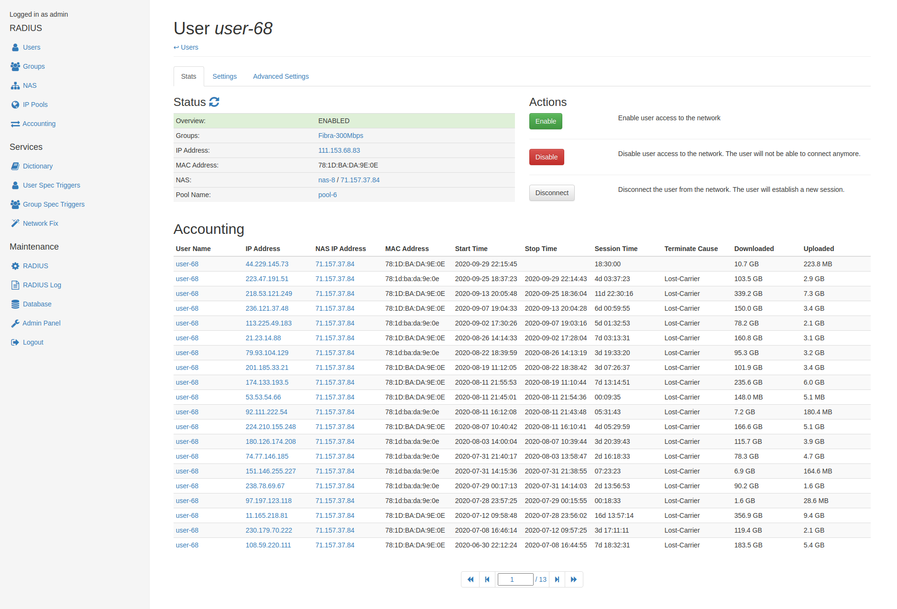
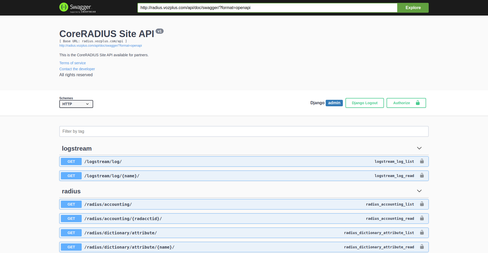

# CoreRADIUS

El sistema CoreRADIUS implementa el protocolo RADIUS (acrónimo en inglés de Remote Authentication Dial-In User Service) y proporciona autenticación y autorización para las aplicaciones de acceso a la red. Así, permite un control centralizado de los usuarios que conectan a la red y determina las características de la conexión como por ejemplo son el ancho de banda o la dirección IP asignada. Para una información más detallada sobre el protocolo RADIUS existe una literatura abundante en Internet (https://wiki.freeradius.org/).

Este sistema está especialmente diseñado para proveedores de acceso a Internet que buscan una manera efectiva de gestionar las conexiones de los usuarios a su red y cumplir en materia de auditoría y control. En concreto, las operaciones habituales son:

- Creación y gestión de usuarios. Un usuario consiste en unas credenciales que otorgan acceso a nuestra red mediante tunel PPPoE o DHCP según los términos en que el cliente realice la contratación de los servicios.

- Creación y gestión de grupos. Los grupos son plantillas de configuración que simplifican la gestión de las características de conexión de los usuarios. Por ejemplo, es habitual crear grupos para las diferentes velocidades de conexión que pueden contratan los clientes.

- Creación y gestión de NAS. Un NAS (acrónimo en inglés de Network Access Server) es un servidor de acceso a la red que se encuentra entre el usuario y nuestra red. Para clarificar el concepto, en el caso de proveedores de Internet locales es habitual encontrar dispositivos MikroTik desempeñando el rol de servidores NAS.

- Creación y gestión del pool de direcciones IP. Las direcciones IP son números que sirven para identificar de manera lógica a un dispositivo conectado a la red. A los usuarios que ganan acceso a la red y se les debe asignar una dirección IP durante su sesión de conexión.

- Consulta del histórico de conexiones de usuarios y direcciones IP asignadas. Además de permitir realizar comprobaciones o auditorías, esta funcionalidad es útil ante solicitudes judiciales y de los cuerpos de seguridad para identificar a personas en caso de delitos.

## Arquitectura del sistema

El sistema CoreRADIUS ha sido diseñado e implementado utilizando una arquitectura que combina varios componentes trabajando de forma coordinada. La ventaja de esta solución es que se logra un sistema adaptable para cada empresa, utilizando sólo aquellas funcionalidades que sean necesarias:

- **FreeRADIUS**. Este servidor es la implementación de referencia del protocolo RADIUS y es código libre. El sistema CoreRADIUS utiliza como base el servidor FreeRADIUS en su última versión. No obstante, hemos realizado mejoras importantes en la estructura de la base de datos de FreeRADIUS para alcanzar un rendimiento superior.

- **CoreRADIUS backend**. Esta aplicación ofrece una interfaz de interacción completa con el servidor FreeRADIUS. Además, extiende su funcionalidad para contemplar casos habituales en la operativa de gestión de usuarios de los proveedores de acceso a Internet. Ofrece así mismo una API de tipo REST para integrar con sistemas externos. Como funcionalidades destacables cuenta con validadores de datos para reforzar la correctitud de la información, sistema de backup automático y mecanismos de autorecuperación en caso de fallo catastrófico de servidores NAS.

- **CoreRADIUS frontend**. Esta aplicación es una interfaz web sencilla y fácil de utilizar. Hace posible que personal sin conocimiento en redes gestione la operativa diaria. Interactúa con el sistema conectando a CoreRADIUS backend. No obstante, otras implementaciones por parte de la empresa son posibles para adecuarlo a su caso o integrarlo con sistemas de facturación actualmente implantados.

- **Ready to go!** Esta aplicación web hace posible que un usuario pueda activar el servicio de Internet en modalidad prepago realizando la compra a través de una pasarela de pago segura. De esta forma la gestión de este tipo de servicios queda totalmente automatizada.

## Utilización

En esta parte del documento describimos las operaciones habituales que pueden realizarse con el sistema CoreRADIUS. Para operar de forma habitual, utilizamos la interfaz web de CoreRADIUS frontend. Esta interfaz dispone de un menú en el lateral izquierdo donde seleccionamos la opción en la que estemos interesados: Users, Groups, NAS… Una vez seleccionada la opción, el contenido se mostrará en el resto de la página.

Como se aprecia, el menú de opciones se organiza en tres partes. La primera parte, RADIUS, trata sobre las entidades que se gestionan para configurar el servidor de RADIUS. La segunda parte Services se refiere a funcionalidades adicionales no nativas de FreeRADIUS implementadas por CoreRADIUS. Por último, en Maintenance tenemos las opciones para la gestión y el mantenimiento de la instancia de CoreRADIUS en ejecución.

### RADIUS

Las opciones en la parte RADIUS del menú permiten alterar la configuración para usuarios, grupos, servidores NAS, pools de direcciones IP y registros de conexión. Para estas entidades la aplicación ofrece vistas de visualización de listado de entidades, visualización de una entidad individual, y también vistas para la creación, actualización y eliminación de entidades.

#### Usuarios

La vista de listado de usuarios organiza los usuarios y permite filtrarlos y buscarlos según nombre, dirección IP o estado (habilitaro o deshabilitado).

Luego tenemos la vista de creación de usuarios, que sólo precisa de indicar el nombre de usuario, una contraseña y el grupo al que pertenece. Para crear un usuario hay que seleccionar la opción de usuarios en el menú lateral y luego pulsar en el botón con símbolo más en el lateral superior a la derecha de la página.

La vista de detalle de un usuario se divide en pestañas. En la primera se muestra el estado de su conexión, las acciones de habilitar, deshabilitar y desconectar y los registros de conexión. Esta vista es muy útil para conocer en qué situación se encuentra la sesión del conexión del usuario y para analizar si ha tenido problemas a partir de sus registros de conexión. Por ejemplo, si observamos que tiene sesiones cortas con desconexiones con motivo a interrupciones, entonces puede ser un indicativo de que su instalación debe ser revisada.

La vista de la segunda y tercera pestaña se refieren a los parámetros de configuración que toma el usuario de acuerdo a FreeRADIUS. La pestaña de Settings no es más que una forma simplificada y abreviada de configurar los parámetros habituales frente a Advanced Settings que permite configurar todos los parámetros. De esta forma los usuarios con perfil más próximo a la atención de clientes utilizarán la configuración normal, y los usuarios con perfil técnico la configuración avanzada en caso de ser necesario.

#### Grupos

Una vez familiarizados con las vistas de usuario, las relativas a grupos son similares. La vista de listado permite filtrar y buscar por nombre de grupo. Además, esta vista ofrece información sobre el número de usuarios que pertenecen a cada grupo.

Así mismo, para crear nuevos grupos pulsamos sobre el botón con el símbolo más que hay en la parte superior derecha en la vista del listado de grupos.

Una vez se crea o selecciona un grupo, se muestra el listado de registros tipo check y reply con sus atributos, operadores y valores. Esta vista es similar a la de configuración avanzada de usuarios. Lo habitual es configurar inicialmente los grupos por parte del equipo técnico y posteriormente limitarse a la selección del grupo adecuado cuando se crean usuarios en el sistema.

#### NAS

Aquí las vistas vuelven a ser igual de sencillas e intuitivas que las anteriores. En este caso, la vista de listado permite filtrar por nombre de nas o alias.

La vista para crear el NAS se accede igual que las vistas anterior, pulsando sobre el botón con símbolo más en la vista de listado. En este caso se ofrece un formulario vacío que deberá rellenarse conforme a la configuración que se precise.

La vista en detalle ofrece un formulario editable con los valores asociados a cada campo de configuración del servidor NAS seleccionado desde la vista de detalle.

#### IP Pool

La vista de listado además de permitir filtrar por nombre, ofrece información útil sobre el tamaño de los pools y el número de direcciones IPs habilitadas, en uso, disponibles y deshabilitadas. Además, una barra ofrece una visualización intuitiva para detectar problemas de un rápido vistazo.

Para crear una nueva IP Pool hacemos click sobre el botón con símbolo más en el lado superior derecho de la página e indicamos su nombre.

La vista de detalle en este caso muestra las direcciones que contiene el pool u el uso o asignación de cada dirección IP. Las direcciones del pool pueden ser modificadas a través del botón de edición en la parte superior derecha de la página. Desde ahí se pueden agregar o eliminar rangos de direcciones IP al pool.

#### Accounting

La vista de accounting sólo ofrece un listado con filtro y búsqueda. Este listado muestra todos los registros de conexión de los usuarios. Las opciones de filtro y búsqueda son varias.

### Services

Las opciones de servicios ofrece funcionalidades adicionales que complementan y mejoran al servidor de FreeRADIUS.

#### Dictionary

En la vista de diccionario se muestra información sobre los atributos y valores que se utilizan para configurar a usuarios y grupos de RADIUS. Esta información es útil para explorar las posibilidades que ofrece el servidor de FreeRADIUS. Para obtener información en mayor detalle recomendamos leer la documentación de la página FreeRADIUS.

#### User Spec Triggers / Group Spec Triggers

Estas dos opciones del menú muestran disparadores para cambios de configuración que se pueden hacer sobre usuarios o grupos programados para fechas concretas. Por ejemplo, esta funcionalidad permite habilitar o deshabilitar usuarios o alterar velocidades de grupos en fechas concretas.

#### Network Fix

Esta opción del menú de servicios implementa la funcionalidad de autoreparación disponible en CoreRADIUS. La autoreparación sirve para reparar los conflictos de direcciones IP en la red cuando se dan situaciones catastróficas como caídas, reconexiones o reemplazos de servidores NAS. Cuando estas situaciones se producen, las direcciones IPs pueden quedar bloqueadas durante un tiempo prudencial por parte de FreeRADIUS. La funcionalidad de autoreparación detecta esta situación en servidores NAS MikroTik y realiza las correcciones oportunas.

### Maintenance

Las opciones del grupo de mantenimiento permiten realizar labores básicas de mantenimiento de la instancia de CoreRADIUS y los servicios de que depende. En concreto, con estas opciones se puede controlar el servicio de FreeRADIUS para iniciarlo, pararlo o reiniciarlo además de mostrar el log de datos. Así mismo, también se puede controlar el servicio relativo al sistema de gestión de bases de datos.

#### RADIUS

La vista del servicio del servidor FreeRADIUS muestra información sobre el servicio ejecutándose en el sistema. Desde esta vista se puede gestionar el servicio. Esta vista es útil para solicitar el reinicio del servidor en campo de cambiar la configuración del servicio mediante los archivos de configuración del sistema.

#### RADIUS Log

Esta vista permite comenzar el proceso de lectura de los eventos que se agregan al archivo de log de la instancia en ejecución de FreeRADIUS. Es de utilidad para comprobar que el funcionamiento del programa se desarrolle de la forma planificada ante la aplicación de cambios.

#### Database

Esta vista de servicio es análoga a la del servicio FreeRADIUS. Se puede interactuar con el sistema de gestión de base de datos PostgreSQL mediante esta vista.

#### Admin Panel

El panel de administración se refiere a la vista de administración que proporciona el componente de CoreRADIUS backend. Desde este panel de administración se pueden controlar las entidades de RADIUS así como crear usuarios para el sistema y gestionar los permisos. Sin embargo, el objetivo de este panel es para servir a personal con preparación técnica, de manera que una vez configurado todo se puede limitar a la interfaz web sencilla la operativa sobre el sistema CoreRADIUS.

### Interfaz de programación de la aplicación API REST

Tal y como se mencionó al inicio de la documentación, el componente de CoreRADIUS backend incluye una interfaz de programación de la aplicación mediante API REST. De hecho, esta es API se utiliza por parte de CoreRADIUS frontend y también de Ready to go! Con esta interfaz se permite a desarrolladores y a otras plataformas interactuar con el sistema CoreRADIUS e implementar los procesos de negocio necesarios de la empresa.

El sistema proporciona información extensa y detallada a través de diferentes vistas de documentación y ayuda tal y como se muestra en las siguientes capturas.

## Ready to go!

Un componente especialmente útil es Ready to go!, que consiste en una aplicación web que interactúa con CoreRADIUS backend para crear activaciones de servicios de Internet mediante la contratación y pago de los usuarios por medio de una pasarela de pago segura.

Esta aplicación es idela para automatizar todo el proceso de contratación en modalidad prepago de usuarios una vez se haya realizado la instalación física. Este servicio se ha mostrado especialmente útil en el caso de viviendas vacacionales o segundas viviendas donde los inquilinos sólo están presentes una parte del año y quieren tener control de cómo y cuándo pagan por sus servicios.

Está disponible una instancia en ejecución que corresponde a un cliente real en la dirección https://go.vozplus.com.

